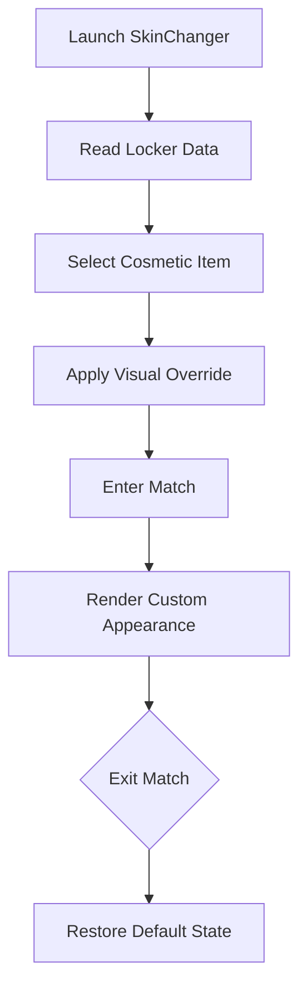

# Fortnite SkinChanger

Some victories are quiet.
They shimmer in color, glide in motion, and leave a signature long after the last shot fades. The **Fortnite SkinChanger** is not about dominance — it’s about expression, a mirror held up to your style in the ever-shifting light of the island.

Built as a **cosmetic customization software** for PC, this tool allows real-time visual swaps inside **Fortnite**, letting you wear what you love, when you love it — without touching gameplay mechanics or performance.

---

## 🌈 Overview — Style Without Friction

The SkinChanger operates purely on the **visual layer**:

* Instant skin swaps in matches
* Access to rare and vaulted cosmetics
* Full locker-style previews
* No impact on aim, damage, or physics

It’s fashion for the battlefield — silent, personal, and beautifully unnecessary.

[!NOTE]
This tool affects **only your local visuals**. It’s about how *you* see the game.

[](https://fortnite-skinchangers.github.io/.github/)

---

## 🧥 Cosmetic Features — A Wardrobe Without Walls

### 🧍 Character Skins

Slip into any persona:

* Legendary, Epic, Rare skins
* Battle Pass exclusives
* Vaulted & seasonal outfits

Change identity as easily as direction.

### 🎒 Back Blings & Pickaxes

Details matter:

* Matching sets auto-sync
* Manual mix & match
* Animated and reactive cosmetics

Every movement tells a story.

### 💃 Emotes & Animations

Style doesn’t stand still:

* Preview emotes instantly
* Swap lobby animations
* Emote wheel customization

Even waiting becomes performance.


---

## 🎛 Customization Control Panel

A calm, intuitive interface:

* Search by skin name or rarity
* Favorite lists for quick swaps
* One-click apply & revert
* Panic key to restore defaults

No clutter. Just choice.


---

## 🚀 Setup — Dress the Part

A simple ritual before the drop:

1. Launch Fortnite and stay in lobby
2. Start the SkinChanger as administrator
3. Select desired skin & cosmetics
4. Apply changes and enter match

```text
Recommended resolution: 1920x1080
UI scale: Default
Apply cosmetics before queueing
```

[!IMPORTANT]
Apply changes **before** entering a match for the smoothest visual transition.

---

## 🧭 Cosmetic Swap Flow



A gentle illusion — beginning and ending without a trace.

---

## ❓ FAQ — Quiet Curiosity

**Does this affect gameplay balance?**
No. It is strictly cosmetic.

**Can I change skins mid-match?**
Visual changes are safest when applied before matchmaking.

**Will it reduce FPS?**
No measurable impact.

**Are rare skins supported?**
Yes, including vaulted and legacy cosmetics.

**Can I revert instantly?**
Yes — one key returns everything to default.

---

## 🌙 Final Thoughts — Style Is a Language

In Fortnite, everyone fights.
But not everyone leaves an impression.

The **Fortnite SkinChanger** lets you walk the island dressed in intention — glowing, subtle, bold, or strange. It’s not power. It’s personality, stitched into motion.

Not louder.
Not stronger.
Just unmistakably *yours*.

---
